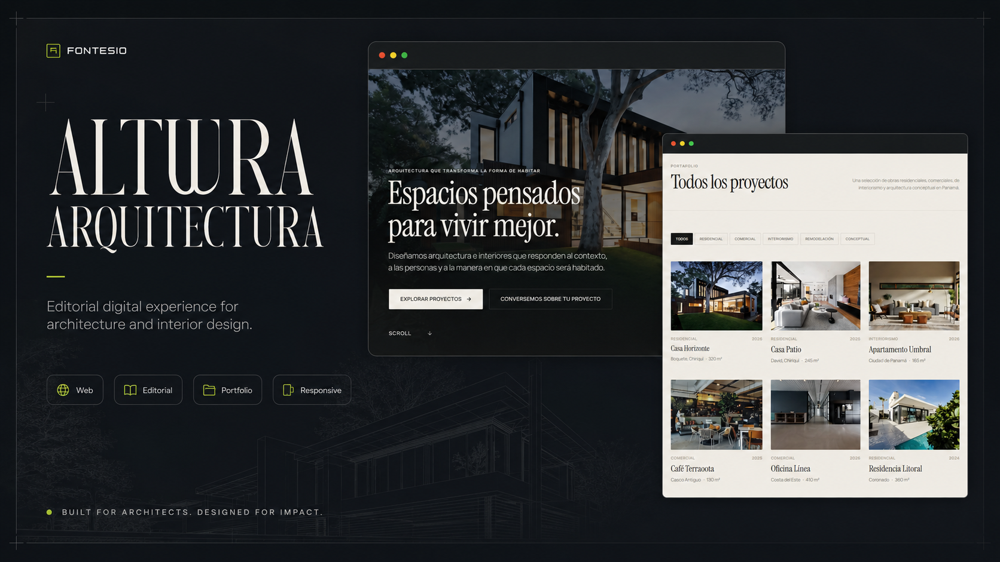
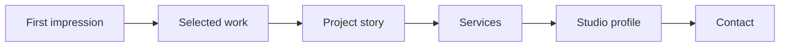
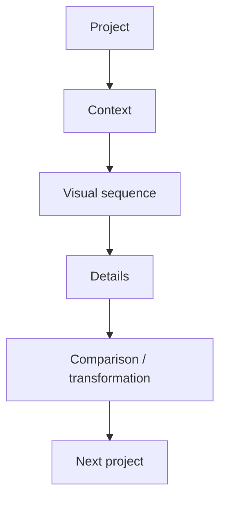

<p align="center">
  
</p>

<br />

<div align="center">

# ALTURA ARQUITECTURA

### An editorial digital experience for a fictional architecture & interior design studio in Panama.

**Architecture deserves more than a gallery grid.**

[](https://nextjs.org/)
[](https://www.typescriptlang.org/)
[](https://tailwindcss.com/)
[](https://vercel.com/)

[Live Demo](https://alturaarquitectura.vercel.app/) · [Fontesio](https://fontesio.vercel.app/es)

</div>

---

## The brief

Architecture portfolios often suffer from the same problems:

- Heavy imagery
- Weak hierarchy
- Confusing navigation
- Poor mobile presentation
- Projects treated as isolated image dumps
- Very little conversion intent

Altura explores a different approach:

> **A portfolio that behaves like an editorial experience and a commercial website at the same time.**

---

## Experience structure



The website is designed to move from visual impact to context and then to action.

---

## Core experience

<table>
<tr>
<td width="50%" valign="top">

### Portfolio

- Full-screen hero
- Filterable project portfolio
- Individual project pages
- Image galleries
- Project-to-project navigation
- Before / after or plan / result comparison
- Image-first storytelling

</td>
<td width="50%" valign="top">

### Commercial layer

- Services
- Studio profile
- Contact
- WhatsApp CTA
- Localized SEO
- Spanish / English
- Mobile-first behavior
- Accessible responsive layout

</td>
</tr>
</table>

---

## Design direction

Altura is intentionally more editorial than “SaaS-like”.

```text
Photography        Primary visual language
Typography         Strong hierarchy
Layout             Spacious editorial composition
Motion             Restrained and purposeful
Navigation         Project-first
Mobile             Treated as a core experience
```

The interface gives the work room to breathe instead of surrounding it with unnecessary UI.

---

## Project storytelling

A project page is not only:

```text
Title
Image
Image
Image
Image
```

The experience is structured to support a narrative:



---

## Technical implementation

```text
Framework      Next.js
UI             React
Language       TypeScript
Styling        Tailwind CSS
Components     shadcn/ui
Motion         Motion / Framer Motion
Icons          Lucide
Images         next/image
Content        Typed content
i18n           Spanish / English
SEO            Dynamic metadata + localized structure
Deployment     Vercel
```

---

## Performance matters

Image-heavy websites can become slow very quickly.

The implementation therefore treats media delivery as part of the product:

- Responsive image handling
- `next/image`
- Structured content
- Controlled motion
- Responsive layouts
- SEO-aware metadata
- Accessible interaction patterns

---

## What this project demonstrates

Altura exists to demonstrate a specific capability:

> **Building a premium commercial website where visual identity, portfolio storytelling and technical execution work together.**

It is not presented as a real client engagement or as evidence of fabricated business results.

---

## Status

**Concept website · Published · 2026**

Altura Arquitectura is a fictional architecture and interior design studio created as a portfolio case study.

---

## Built by

**José Fuentes**  
Software Developer · Founder, **Fontesio**

[Live Demo](https://alturaarquitectura.vercel.app/) · [Fontesio](https://fontesio.vercel.app/es)

<div align="center">

### Built to make the work feel as considered as the architecture.

</div>
